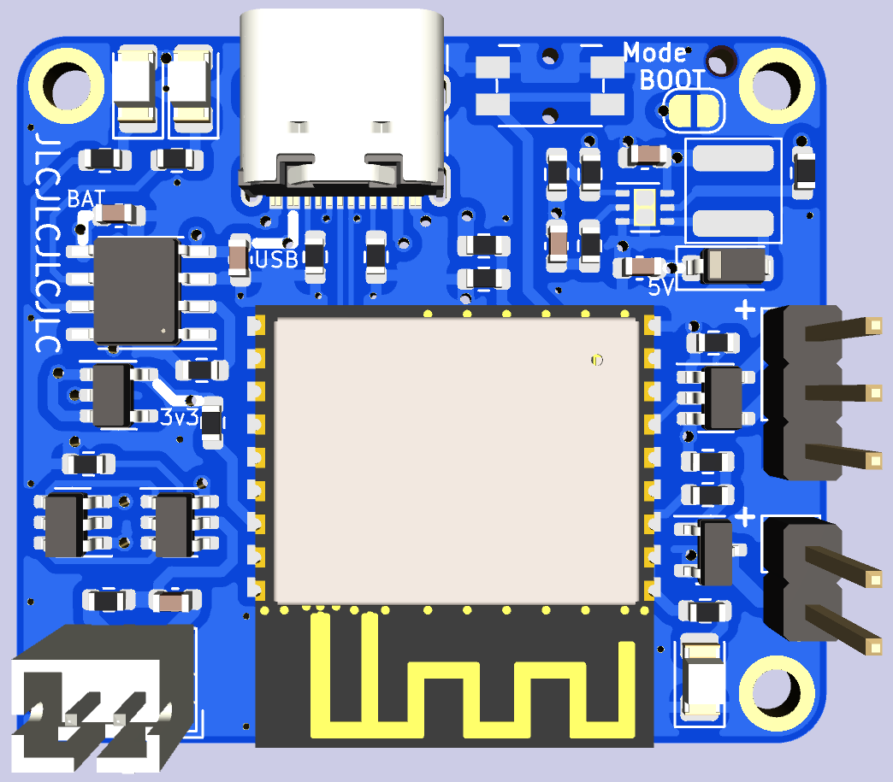

# LED Bracelet

Single-cell LED Bracelet controlled by ESP32-C3.

While the bracelet can work in "standalone" mode, it is recommended to connect it to other devices using [BLE](https://en.wikipedia.org/wiki/Bluetooth_Low_Energy).

**This board is untested.**

Designed to be manufactured by [JLCPCB](https://jlcpcb.com/) as 4layer PCB with both inner layers acting as GND (you can probably use just the outer layers).

Requires [Espressif's KiCad Libraries](https://github.com/espressif/kicad-libraries).

## Features

- 5V LED strip
  - Designed for `WS2812B` LEDs
- 5V LED filament (outline)
  - Most of those filaments are 3V so use two of them, 2.5V should be enough
- USB-C charging
  - 5V 1.5A max (5.1k resistors)
  - `TP4056` charger
    - Status LEDs
      - Red = Charging
      - Blue = Standby
    - 1S 1A charging (1 cell in series, unlimited in parallel)
  - 1.5A discharge (`DW01A`)
  - Voltage measurement
    - 3/4 of voltage
    - Max 4.4V
- ESP32-C3 controller
  - BLE controls
  - Button to cycle colors

### Possible future features

- Gyro+accelerometer to measure hand movement
- Dedicated BLE button + status LED

## TODO

- Add assembly tooling holes
